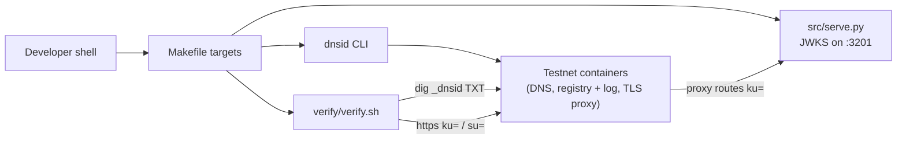

# Architecture

## Overview

This recipe publishes a DNSid identity for `publish.dev.dnsid.test` on the
local DNSid testnet and serves its JWKS from a minimal standard-library HTTP
server. The testnet (DNS server, registry, transparency log, TLS proxy) is
managed entirely by the `dnsid` CLI — the recipe owns no containers.

The recipe demonstrates publication and inspection, not request signing:
`make bootstrap` runs the provisioning lifecycle, `src/serve.py` answers the
record's `ku=` URL, and `verify/verify.sh` walks the record the way a
verifier would (TXT → `ku=` JWKS → kid match → `su=` status).

## Components

| Component | File | Role |
|---|---|---|
| Make targets | `Makefile` | Wrap testnet lifecycle, identity provisioning, the JWKS server, and verification. |
| Testnet | managed by `dnsid testnet up/down` | DNS on `127.0.0.1:7753`, registry + transparency log on `127.0.0.1:7755`, TLS proxy on `127.0.0.1:443`. |
| JWKS server | `src/serve.py` | Serves `DNSID_CONFIG_DIR/public.jwk` as `/.well-known/jwks.json` on the identity's upstream port. |
| Verifier walk | `verify/verify.sh` | Runs under `dnsid testnet run`; resolves the TXT binding, follows `ku=` and `su=`, matches the served kid to the local keypair. |

## Flow

1. `make bootstrap`: `dnsid testnet up`, then `dnsid testnet agent ensure
   publish ... -- dnsid log issue` — keypair, registration, signed challenge,
   published `_dnsid` record, countersigned ISSUANCE entry. Idempotent.
2. `make run` / `make verify`: launch `src/serve.py` under `dnsid testnet run
   publish`, which injects `DNSID_CONFIG_DIR` (the keypair), `DNSID_DNS_SERVER`,
   and `DNSID_CA_BUNDLE`.
3. Verification resolves `_dnsid.publish.dev.dnsid.test` TXT from the testnet
   DNS, fetches the `ku=` JWKS through the TLS proxy, asserts the served `kid`
   equals the local `public.jwk`'s, and asserts `su=` reports `READY`.
