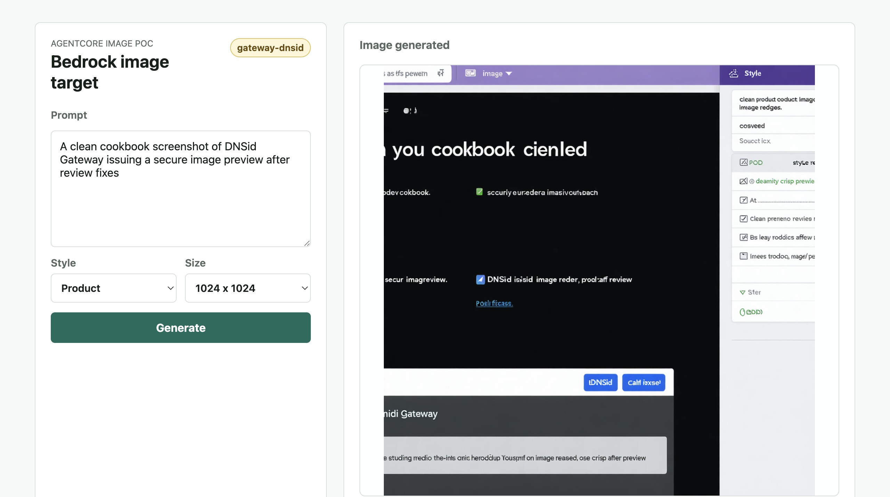
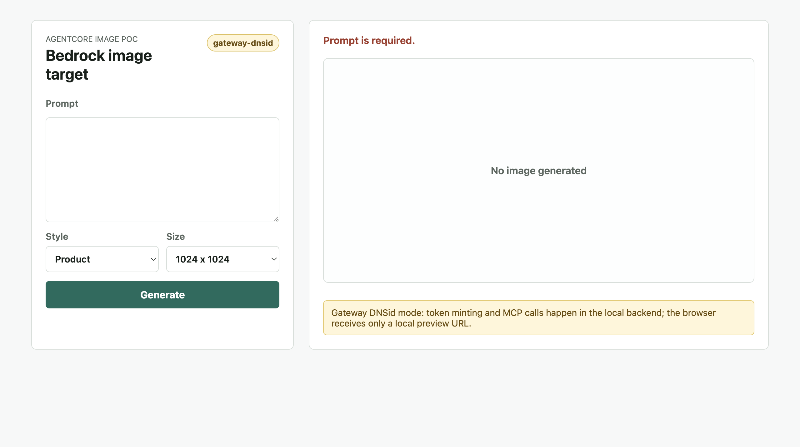

# Recipe 07 — AgentCore Gateway MCP image tool with DNSid

> Generate a Bedrock image through an AgentCore Gateway MCP tool that authenticates with a DNSid-issued JWT.

**Spec version:** `draft-ihsanullah-dnsid-agentcore-gateway-mcp-image-poc`
**Status:** deploy-only
**Standards used:** RFC 7517 (JWKS), RFC 7519 (JWT), Model Context Protocol (MCP), Amazon Bedrock AgentCore Gateway `CUSTOM_JWT`
**Estimated time:** ~45 minutes with AWS and DNSid lab credentials

---

## What you'll build

This recipe builds a small image-generation target behind Amazon Bedrock AgentCore Gateway. The Gateway is the MCP server: it validates a DNSid-issued JWT, exposes `generate_image` and `whoami_dnsid`, invokes an API Gateway/Lambda target, stores the generated PNG and audit JSON in S3, and proves the call is tied to the configured DNSid lab identity. A local web UI is included for humans to try the same authenticated path: the browser calls only the local backend, and that backend mints the DNSid token server-side, invokes Gateway MCP, fetches the generated image, and returns a local preview URL. A separate `local-test` fallback remains for local Bedrock/UI troubleshooting.

For the component wiring and runtime flow, see [architecture.md](architecture.md).

## Why this matters

MCP gives agents a standard way to call tools, and AgentCore Gateway gives those tools a managed front door. DNSid adds a domain-bound identity to that front door: the client mints a Gateway-audience JWT for its DNSid agent, Gateway validates that token with DNSid's OIDC metadata and JWKS, and the target receives only normalized trusted context. After this recipe, the image tool has a real visual result and a real audit trail without accepting user-supplied identity fields or shared static API keys.

## Prerequisites

- Python 3.11+
- `make`
- AWS CLI credentials for the AWS account you will use, with access to:
  - Bedrock image generation in `us-west-2`
  - Bedrock AgentCore Gateway, API Gateway, Lambda, IAM, S3, and CloudWatch in `us-east-1`
- DNSid lab CLI available as `dnsid` on `PATH`, or set `DNSID_CLI=/path/to/dnsid`
- DNSid server URL. Defaults to `https://api.dev.dnsid.ai`; override with `DNSID_SERVER`
- DNSid lab agent domain provided with `DNSID_AGENT_DOMAIN`
- DNSid lab credentials for the chosen agent in a server-side identity directory containing `config.json` and `private.jwk`; set `DNSID_CONFIG_DIR` when it is not the current CLI identity
- Browser Console Bridge and Chrome extension if you want to reproduce the UI screenshot checks

This is a deploy-only recipe: the full verification path creates or updates recipe-owned AWS resources. It does not create DNSid DNS records, create new DNSid agents, revoke the lab agent, or run Gateway cleanup. The local UI is a convenience client for the deployed Gateway path, not a standalone hosted application.

## Lab and AWS account PoC limits

This recipe assumes the DNSid lab agent and AWS account you provide in the environment. It targets the DNSid development API at `https://api.dev.dnsid.ai`, Bedrock image generation in `us-west-2`, and AgentCore Gateway resources in your active AWS account in `us-east-1`.

You can override `DNSID_CLI`, `DNSID_SERVER`, `DNSID_AGENT_DOMAIN`, and `DNSID_CONFIG_DIR`, but the recipe still expects a ready DNSid agent with local lab credentials and AWS permissions to create recipe-owned Gateway, Lambda, API Gateway, IAM, S3, and CloudWatch resources. It does not automate DNSid identity creation, DNS publication, hosted browser authentication, multi-user authorization, or production revocation policy.

Gateway commands read DNSid configuration from the environment. `DNSID_AGENT_DOMAIN` is required for the Gateway path; the local CLI binary path is intentionally not user-specific:

```bash
export DNSID_CLI=dnsid
export DNSID_SERVER=https://api.dev.dnsid.ai
export DNSID_AGENT_DOMAIN=<your-agent-domain>
export DNSID_CONFIG_DIR=/path/to/your/dnsid/identity
```

The deployed application path mints tokens directly with `dnsid-py`; `DNSID_CLI` is used only by operator probe and verification scripts.

## Concepts

- **DNSid** - a DNS-bound identity system for agents and services. In this recipe the DNSid lab service issues the JWT that represents the configured `DNSID_AGENT_DOMAIN`.
- **JWT** - JSON Web Token ([RFC 7519](https://datatracker.ietf.org/doc/html/rfc7519)), a signed JSON claim set. Gateway checks the token issuer, audience, expiry, signature, and any configured custom claims.
- **JWKS** - JSON Web Key Set ([RFC 7517](https://datatracker.ietf.org/doc/html/rfc7517)), the public-key document Gateway uses to verify DNSid JWT signatures.
- **Protected resource / audience** - the AgentCore Gateway MCP URL. The DNSid token's `aud` claim must exactly match this value, or Gateway rejects the token.
- **MCP** - Model Context Protocol, the JSON-RPC protocol agents use to initialize sessions, list tools, and call tools.
- **Request interceptor** - a Gateway Lambda hook that turns validated token claims into trusted `x-dnsid-*` headers for the target. Client-supplied trusted headers are overridden.
- **Response interceptor** - a Gateway Lambda hook that filters `tools/list` for this recipe. Direct calls to hidden or disallowed tools still fail.
- **Audit artifact** - a JSON object written to S3 for each successful deployed `generate_image` call. The verifier fetches it and checks identity, token `jti`, tool, artifact, model, request, correlation, and result fields.

## Authorization controls

Live authorization in this PoC is enforced by AgentCore Gateway `CUSTOM_JWT` validation, the request/response interceptors, IAM permissions, and the API Gateway resource policy that denies direct target invocation outside the Gateway role. The deploy output's `subject_enforcement` field reports whether Gateway also enforces the lab `sub` with custom claims (`gateway_custom_claims`) or the lab `sub` check is left to the request interceptor (`downstream`); the interceptor check runs in both modes. The Cedar file at `infra/policy/image-tools.cedar` is illustrative only: deploy and verify commands do not read it, and Cedar is not part of the enforced control plane for this recipe.

## Docker stack

This recipe does not use Docker.

| Service | Image | Role |
|---|---|---|
| Local UI/API | N/A | Python process from `image_poc.server`; in default `gateway` mode it mints DNSid tokens server-side and calls Gateway MCP, while `local-test` mode calls Bedrock directly for fallback debugging |
| AgentCore Gateway | N/A | AWS managed MCP endpoint with DNSid `CUSTOM_JWT` auth |
| API Gateway/Lambda/S3 | N/A | AWS target, image artifact store, and audit store |

## Step 1 — Install the recipe environment

```bash
cd recipes/07-agentcore-gateway-mcp-image-poc
make setup
```

This creates `.venv/` and installs the recipe package in editable mode. The virtual environment and generated package metadata are ignored by git.

## Step 2 — Probe the Bedrock image model

```bash
make probe-model
```

The probe invokes `stability.sd3-5-large-v1:0` in `us-west-2` and writes a local PNG under `.artifacts/probe/`. Expected output shape:

```json
{
  "status": "ok",
  "selected_model_id": "stability.sd3-5-large-v1:0",
  "region": "us-west-2",
  "mime_type": "image/png",
  "width": 1024,
  "height": 1024
}
```

## Step 3 — Probe DNSid and AgentCore surfaces

```bash
make probe-gateway
```

This is read-only. It checks the AWS account, AgentCore control-plane availability, DNSid OIDC metadata, lab-agent status, and safe token claims. It never prints the bearer token.

Expected output includes:

```json
{
  "account_id": "<AWS_ACCOUNT_ID>",
  "dnsid_oidc": {
    "issuer": "https://api.dev.dnsid.ai",
    "jwks_uri": "https://api.dev.dnsid.ai/.well-known/jwks.json"
  },
  "dnsid_status": {
    "domain": "<your-agent-domain>",
    "status": "READY"
  },
  "token_claims": {
    "sub": "<your-agent-domain>",
    "jti_present": true
  }
}
```

## Step 4 — Deploy the Gateway target

```bash
make deploy-gateway
```

This creates or updates recipe-owned AWS resources in `us-east-1`: IAM roles, target and interceptor Lambdas, an API Gateway REST API, an S3 bucket/prefix, and the AgentCore Gateway/target. The deploy script first discovers the Gateway protected-resource metadata, then configures Gateway `allowedAudience` to the discovered MCP URL. It requests Gateway custom-claim checks for the lab DNSid subject, falling back when the control plane rejects them; `subject_enforcement` reports whether Gateway accepted the custom-claims check (`gateway_custom_claims`) in addition to the interceptor check, or whether the lab `sub` check remains interceptor-only (`downstream`). The interceptor check runs in both modes.

Expected output shape:

```json
{
  "status": "ok",
  "gateway_id": "dnsidimagepocphase3gateway-...",
  "gateway_audience": "https://...gateway.bedrock-agentcore.us-east-1.amazonaws.com/mcp",
  "subject_enforcement": "gateway_custom_claims",
  "discovery_filter_mode": "response_interceptor"
}
```

Only remove the recipe-owned AWS resources if you intentionally want to tear down the PoC and have inspected the generated state file first.

## Step 5 — Verify the real DNSid/Gateway MCP path

```bash
make verify
```

The `verify` wrapper runs the deployed Gateway verifier. It mints DNSid tokens server-side through the lab CLI and never prints them. It checks:

- missing token is rejected
- wrong-audience token is rejected
- unsigned forged token is rejected
- MCP initialize returns a session
- calls without the session fail
- `tools/list` exposes only `generate_image` and `whoami_dnsid`
- spoofed trusted headers and identity-like tool arguments do not change the trusted DNSid subject
- `generate_image` returns a Bedrock PNG through the Gateway path
- the S3 audit JSON is fetched and verified
- direct unsigned and signed REST calls to the target are denied
- a known filtered tool call returns a JSON-RPC error

Expected output includes this shape:

```json
{
  "status": "ok",
  "direct_unsigned_rest_status": 403,
  "direct_signed_valid_context_rest_status": 403,
  "mcp": {
    "missing_token_status": 401,
    "wrong_audience_status": 403,
    "unsigned_token_status": 401,
    "missing_session_status": 400,
    "session_id_present": true,
    "tools": [
      "ImageApiTarget___generate_image",
      "ImageApiTarget___whoami_dnsid"
    ],
    "artifact": {
      "artifact_s3_uri": "s3://<bucket>/phase3/images/<artifact>.png",
      "audit_s3_uri": "s3://<bucket>/phase3/audit/<date>/<audit>.json",
      "audit_verified": true,
      "width": 1024,
      "height": 1024
    }
  }
}
```

The verifier intentionally omits the short-lived image URL from its printed output.

## Step 6 — Try the local Gateway UI

Run the local UI in one terminal:

```bash
PORT=8788 make dev
```

Open `http://127.0.0.1:8788/`. The badge must say `gateway-dnsid`. The browser stays credential-free: it never receives the DNSid bearer token, Gateway authorization header, or the target's presigned S3 URL. The local backend mints the DNSid token, initializes MCP against AgentCore Gateway, calls `whoami_dnsid` and `generate_image`, fetches the generated image server-side, stores a local preview copy, and returns only `/artifacts/<id>.png` plus non-secret metadata to the browser.

In another terminal, run:

```bash
PORT=8788 make verify-local
```

Expected output includes a generated 1024 x 1024 PNG and the empty-prompt validation error:

```json
{
  "status": "ok",
  "health": {
    "auth_mode": "gateway-dnsid",
    "ok": true
  },
  "generated": {
    "artifact_url": "/artifacts/<local-artifact>.png",
    "auth_mode": "gateway-dnsid",
    "dnsid_sub": "<your-agent-domain>",
    "mime_type": "image/png",
    "remote_artifact_id": "<gateway-artifact-id>",
    "width": 1024,
    "height": 1024
  },
  "validation_error": {
    "code": "validation_error",
    "field": "prompt",
    "message": "Prompt is required."
  }
}
```

Browser Console Bridge checks also verify that the success path has a visible image with non-zero natural dimensions and no console errors, and that the empty-prompt path hides `#outputImage` with no broken image placeholder. The checks inspect the browser-visible response and DOM for token or presigned URL leakage.





To debug only the local Bedrock/UI path without DNSid or Gateway, run the fallback mode on a different port:

```bash
IMAGE_POC_MODE=local-test PORT=8789 make dev
IMAGE_POC_MODE=local-test PORT=8789 make verify-local
```

In fallback mode the badge says `local-test`; that path is not the DNSid/Gateway proof.

## Step 7 — Know what this PoC does not claim

This recipe proves the core DNSid `CUSTOM_JWT` Gateway path, but it does not claim full production token lifecycle hardening.

Covered live:

- DNSid token issuance for the discovered Gateway audience
- Gateway `CUSTOM_JWT` validation using DNSid issuer/JWKS
- lab `sub` propagation as trusted context, with the active mode reported by the deploy output's `subject_enforcement` field
- valid MCP calls through Gateway
- missing-token, wrong-audience, unsigned-token, missing-session, direct REST, tool-filter, and spoofing negatives
- deployed S3 audit verification
- local browser UI backed by server-side DNSid token minting and AgentCore Gateway MCP calls, without exposing tokens or presigned URLs to browser JavaScript

Not claimed:

- wrong-issuer signed-token proof with a second trusted issuer
- expired-token proof with a DNSid-issued expired token
- missing-scope denial, because this two-tool PoC does not require scopes
- invalid second-subject proof with another valid DNSid agent
- revocation or inactive-agent lifecycle behavior
- hosted multi-user browser login or a browser-side Gateway token flow

Those omitted cases either need additional signed issuers or DNSid identities, would require revoking or creating real DNSid resources, or would only prove that a fake unsigned token is rejected. A production deployment that needs immediate revocation should add a live status check or another revocation mechanism on sensitive tool calls.

## Run it

For the full path:

```bash
make setup
make probe-model
make probe-gateway
make deploy-gateway
make verify
```

`make verify` is the deploy-only closeout wrapper for `make verify-gateway`; it requires the deployed Gateway state and lab/AWS access described above.

For the local UI path:

```bash
PORT=8788 make dev
```

Then open `http://127.0.0.1:8788/` and run:

```bash
PORT=8788 make verify-local
```

## Verify

The minimum closeout verification is:

```bash
make test
make coverage
make probe-gateway
make verify
PORT=8788 make verify-local
IMAGE_POC_MODE=local-test PORT=8789 make verify-local
```

Success means:

- unit tests pass
- coverage reports the Python package and scripts
- DNSid lab agent is `READY`
- Gateway verification prints `status: ok`
- `audit_verified` is `true`
- Gateway-backed local UI verification prints `status: ok`
- local-test fallback verification prints `status: ok`
- Browser Console Bridge success/error checks have no console errors

## What to try next

- Add a production status check before image generation if you need immediate DNSid revocation semantics.
- Add hosted UI auth if you need a multi-user browser login flow instead of this local backend-mediated UI.
- Add a scoped policy once the DNSid token service emits scopes needed by a larger tool set.
- Add an `edit_image` tool only after a live Bedrock edit model probe proves the request/response shape and input-size limits.

## Glossary

- **AgentCore Gateway** - AWS managed MCP Gateway. It authenticates clients, manages MCP sessions, lists tools, and forwards allowed calls to configured targets.
- **Audience** - the token recipient named by the JWT `aud` claim. Here it must be the exact Gateway MCP URL discovered from protected-resource metadata.
- **Bearer token** - a token that grants access to whoever presents it. This recipe keeps it server-side and never prints it.
- **CUSTOM_JWT** - AgentCore Gateway authorizer mode that validates a JWT using configured issuer, audience, JWKS, and optional custom claims.
- **DNSid lab agent** - the configured `DNSID_AGENT_DOMAIN` used for this PoC. Its credential directory is local and must not be committed or modified by the recipe.
- **Gateway target** - the API Gateway/OpenAPI backend that AgentCore invokes after accepting an MCP tool call.
- **JTI** - JWT ID. A unique token identifier used here to correlate audit records without logging the token itself.
- **Presigned URL** - a time-limited URL granting access to one S3 object. The target returns one to the MCP caller for image display, but verification output and README examples avoid printing it.
- **Trusted context** - normalized DNSid identity fields injected by the Gateway interceptor. The target trusts these headers only after Gateway authentication, never from client form data.
