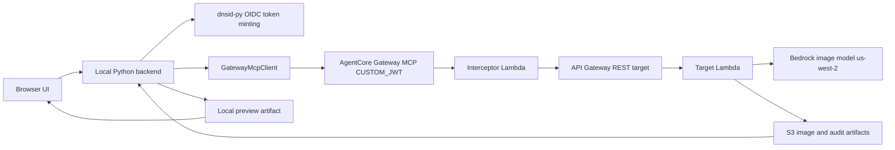
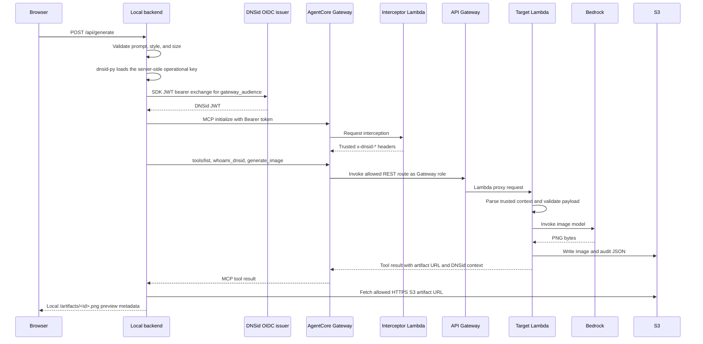

# Architecture

## Overview

This recipe demonstrates a full DNSid-authenticated AgentCore Gateway MCP path
for image generation. A local browser UI talks only to a local Python backend.
That backend mints a DNSid token server-side, calls an Amazon Bedrock AgentCore
Gateway MCP endpoint, fetches the generated image from the target's S3 artifact
URL, and returns only a local preview URL to the browser.

The deployed AWS path contains more than the minimal Gateway: an AgentCore
Gateway, request/response interceptor Lambda, API Gateway REST target, Lambda
target, S3 artifact and audit storage, IAM roles and policies, and Bedrock
image generation in `us-west-2`.

## Components

| Component | File | Role |
|---|---|---|
| Local HTTP server | `src/image_poc/server.py` | Serves static UI, `/api/health`, `/api/generate`, and local preview images. |
| Local app layer | `src/image_poc/app.py` | Switches between `gateway` mode and `local-test` fallback mode. |
| Gateway MCP client | `src/image_poc/gateway_mcp.py` | Loads deployed Gateway state, mints DNSid tokens with `dnsid-py`, initializes MCP, lists tools, calls `whoami_dnsid` and `generate_image`, and fetches remote image artifacts. |
| DNSid config | `src/image_poc/config.py` | Reads `DNSID_CLI`, `DNSID_SERVER`, `DNSID_AGENT_DOMAIN`, `IMAGE_POC_MODE`, and state/artifact paths. |
| Deploy script | `scripts/deploy_gateway_phase3.py` | Creates or updates AWS resources and writes `.artifacts/gateway/phase3-state.json`. |
| Resource helpers | `scripts/gateway_resources.py` | Defines names, tags, IAM policies, OpenAPI rendering, Gateway authorizer/interceptor config, state IO, and waiters. |
| Request/response interceptor | `src/image_poc/interceptor.py` | Decodes already-present bearer claims, validates expected subject/issuer/audience, injects trusted `x-dnsid-*` headers, and filters `tools/list`. |
| Target Lambda | `src/image_poc/aws_handler.py` | Handles `/whoami-dnsid` and `/generate-image`, validates trusted context, calls Bedrock, writes S3 image and audit artifacts. |
| Local fallback generator | `src/image_poc/bedrock_image.py`, `src/image_poc/audit.py`, `src/image_poc/artifacts.py` | Used by `IMAGE_POC_MODE=local-test`; not the DNSid/Gateway proof. |
| OpenAPI target | `infra/openapi/image-api.openapi.json` | Defines `/generate-image`, `/whoami-dnsid`, and excluded `/debug-denied` REST operations for API Gateway. |
| Illustrative policy | `infra/policy/image-tools.cedar` | Documentation-only Cedar example, not read by deploy or verify. |

## Wiring

`scripts/gateway_resources.py` fixes the deployed names and regions:

- AgentCore and API resources run in `us-east-1`.
- Bedrock image generation runs in `us-west-2`.
- Resource names use the `dnsid-image-poc-phase3` prefix.
- The Gateway is named `DnsidImagePocPhase3Gateway`.
- The target is named `ImageApiTarget`.
- The REST API stage is `phase3`.
- State is written to `.artifacts/gateway/phase3-state.json`.

The Gateway authorizer is `CUSTOM_JWT` with discovery URL
`$DNSID_SERVER/.well-known/openid-configuration` and an allowed audience that is
updated after deployment to the Gateway MCP protected-resource URL. The deploy
script tries to enforce the configured `DNSID_AGENT_DOMAIN` as a Gateway custom
claim. If AgentCore rejects that custom-claim configuration, the script records
`subject_enforcement: downstream` and the interceptor still enforces the
subject.

The request interceptor writes only trusted headers into the target request:
`x-dnsid-sub`, `x-dnsid-iss`, `x-dnsid-aud`, `x-dnsid-jti`,
`x-dnsid-domain`, `x-dnsid-scope`, `x-dnsid-auth-mode`,
`x-dnsid-verified-at`, `x-gateway-request-id`, and `x-correlation-id`. The
Gateway target metadata allows those headers through to API Gateway and Lambda.
Client-supplied identity-like tool arguments are ignored and recorded as such
by the target.

## Runtime Flow

The local browser never receives the DNSid bearer token, Gateway authorization
header, target presigned S3 URL, S3 URI, or audit S3 URI. The backend fetches
the remote image and stores a local preview copy under the configured artifact
directory.

## Setup, Deploy, Verify, and Cleanup

| Command | Effect |
|---|---|
| `make setup` | Creates `.venv/` and installs the recipe package with dev dependencies. |
| `make probe-model` | Calls the configured Bedrock image model and writes a local probe artifact. |
| `make probe-gateway` | Checks AWS account, AgentCore control-plane availability, DNSid OIDC metadata, lab-agent status, and token claims without printing tokens. |
| `make deploy-gateway` | Creates or updates IAM roles, target and interceptor Lambdas, API Gateway REST API, S3 bucket/prefix, AgentCore Gateway, Gateway target, and state file. |
| `make verify` | Runs direct REST denial checks and the deployed MCP verifier. |
| `PORT=<port> make dev` | Starts the local UI/API backend. |
| `PORT=<port> make verify-local` | Exercises local health, generation, preview artifact loading, response redaction, and validation error behavior against the running backend. |
| `make clean-artifacts` | Removes local `.artifacts`. |
| `make clean-gateway` | Prints a warning only; AWS cleanup is intentionally manual. |

## Trust and Security Boundaries

- Gateway is the managed JWT enforcement point. It validates issuer, audience,
  signature, expiry, and any accepted custom subject claim.
- The interceptor treats the bearer token as already Gateway-validated, then
  validates expected subject, issuer, audience, expiry, and `jti` before
  creating trusted headers.
- API Gateway has a resource policy that denies direct target invocation unless
  the principal is the Gateway role. The verifier checks both unsigned direct
  calls and signed direct calls with valid-looking trusted headers are denied.
- The Lambda target accepts identity only from trusted headers, never from tool
  arguments or browser JSON.
- S3 artifacts remain server-side in the browser path. The local backend returns
  local preview URLs only.
- `infra/policy/image-tools.cedar` is illustrative and is not an enforced
  control plane for this recipe.

## Operational Notes and Limits

- Defaults target `DNSID_SERVER=https://api.dev.dnsid.ai` and
  `DNSID_AGENT_DOMAIN=<your-agent>.sandbox.dev.dnsid.ai`.
- Gateway mode requires an HTTPS DNSid server and a valid
  `.artifacts/gateway/phase3-state.json`.
- The local server defaults to `127.0.0.1:8787`; the README examples often use
  `PORT=8788` for the browser UI.
- Generated local state lives under `.artifacts/` and is ignored by git.
- The recipe does not create DNSid agents, publish DNS records, revoke lab
  identities, manage hosted browser auth, or automate Gateway teardown.
- `IMAGE_POC_MODE=local-test` is useful for Bedrock/UI debugging but bypasses
  DNSid Gateway authorization and should not be treated as the proof path.
