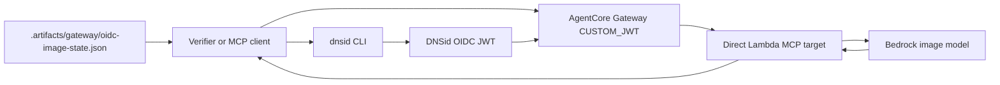
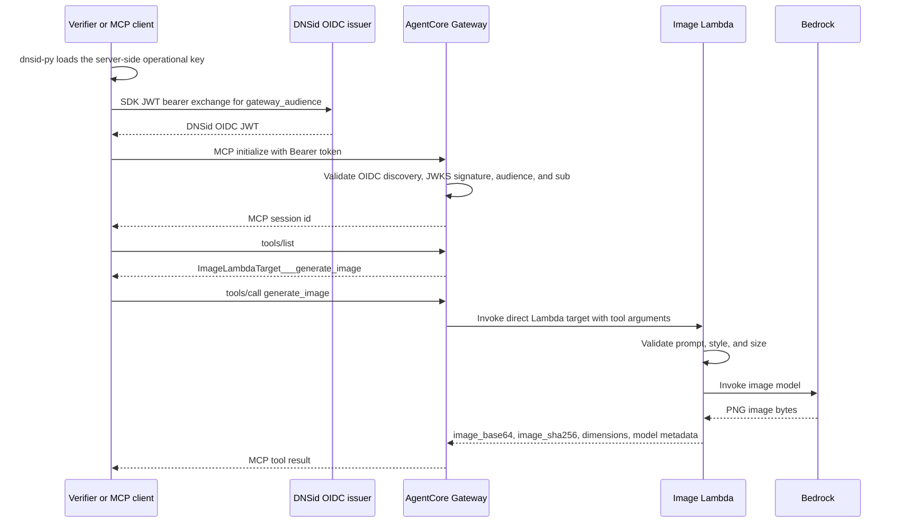

# Architecture

## Overview

This recipe is the minimal AgentCore Gateway OIDC image path. It keeps the
managed Gateway `CUSTOM_JWT` boundary and a direct Lambda MCP target, but drops
the extra pieces used by Recipe 07: no local browser UI, no API Gateway bridge,
no request or response interceptors, no S3 artifact store, and no target-side
trusted DNSid headers.

The Gateway authenticates the DNSid token and authorizes the configured subject
before invoking the Lambda tool. The Lambda receives only tool arguments,
generates an image through Bedrock, and returns base64 PNG bytes plus
non-secret metadata.

## Components

| Component | File | Role |
|---|---|---|
| Lambda handler | `src/oidc_image/lambda_handler.py` | Validates the tool payload, calls the image generator, and returns base64 PNG output. |
| Bedrock generator | `src/oidc_image/bedrock_image.py` | Invokes the configured Bedrock image model and validates PNG dimensions. |
| Payload validation | `src/oidc_image/validation.py` | Enforces prompt, style, and `1024x1024` size constraints. |
| Config | `src/oidc_image/config.py` | Defines default regions, model ID, DNSid CLI/server/domain, and HTTPS issuer validation. |
| Gateway resources | `scripts/gateway_resources.py` | Packages Lambda, manages IAM roles, creates/updates Gateway and direct Lambda MCP target, writes state, and defines tags. |
| Deploy script | `scripts/deploy_gateway.py` | Creates the target Lambda, Gateway role, Gateway, target, and `.artifacts/gateway/oidc-image-state.json`. |
| Verify script | `scripts/verify_gateway.py` | Exercises missing-token, wrong-audience, unsigned-token, session, tools/list, and image-generation checks. |
| Teardown script | `scripts/teardown_gateway.py` | Deletes recipe-owned Gateway, target, Lambda, IAM roles/policies, and Lambda log group after checking the state account. |



## Wiring

The deploy script creates recipe-owned resources tagged with:

```text
Project=dnsid-cookbook
Recipe=07b-agentcore-gateway-oidc-image
```

Resource names use the `dnsid-oidc-image` prefix. The Gateway is
`DnsidOidcImageGateway`, the target is `ImageLambdaTarget`, and the Lambda
function is `dnsid-oidc-image-target`.

The Gateway authorizer is `CUSTOM_JWT` with:

- discovery URL: `$DNSID_SERVER/.well-known/openid-configuration`
- allowed audience: initially a provisional URN, then the discovered Gateway
  MCP URL from protected-resource metadata
- custom claim: `sub` must equal `$DNSID_AGENT_DOMAIN`

The target uses AgentCore's direct Lambda MCP target configuration with inline
tool schema for `generate_image`. Gateway invokes the Lambda using the Gateway
IAM role. The Lambda IAM role can write logs and invoke the configured Bedrock
foundation model.

## Runtime Flow



The Lambda intentionally does not claim to know the DNSid subject. The verifier
rejects any target response that includes identity fields such as
`dnsid_context`, `trusted_identity`, or `x-dnsid-sub`.

## Setup, Deploy, Verify, and Cleanup

| Command | Effect |
|---|---|
| `make setup` | Creates `.venv/` and installs the package with dev dependencies. |
| `make probe-oidc` | Fetches DNSid OIDC discovery and mints/decodes a probe token without printing the token. |
| `make probe-model` | Invokes the configured Bedrock image model. |
| `make deploy-gateway` | Packages Lambda, creates/updates roles, Lambda, Gateway, direct Lambda target, and state file. |
| `make verify` | Runs the deployed Gateway verifier. |
| `make teardown-gateway` | Deletes resources described by the local state file and verifies absence. |
| `make test`, `make coverage` | Run local tests without calling AWS. |

## Trust and Security Boundaries

- Gateway is the only DNSid enforcement point in this recipe.
- The target Lambda receives tool arguments only; it does not receive or assert
  trusted identity context.
- The DNSid token must have the Gateway MCP URL as audience after deployment.
- Existing AWS resources with the recipe's expected names are updated only when
  tags match this recipe.
- The teardown script refuses to run when the state account does not match the
  current AWS caller.

## Operational Notes and Limits

- AgentCore defaults to `us-east-1`; Bedrock defaults to `us-west-2`.
- The default DNSid issuer is `https://oidc.dnsid.dev`, and HTTPS is required.
- State is local and gitignored at `.artifacts/gateway/oidc-image-state.json`.
- The Lambda returns base64 image data directly through MCP, so this recipe does
  not create or clean up S3 image artifacts.
- There is no browser UI, no local preview server, no API Gateway, no
  interceptor, and no audit log in this minimal variant.
