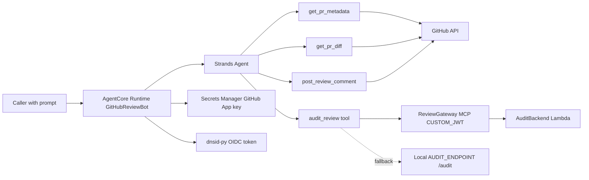
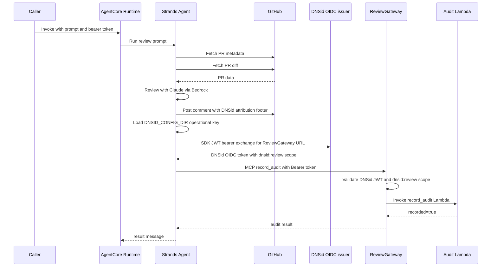

# Architecture

## Overview

This recipe deploys a GitHub pull-request review bot on Amazon Bedrock
AgentCore Runtime and records review audits through an AgentCore Gateway MCP
tool. DNSid is used for bot identity: review comments include the bot's DNSid
domain as a verifiable attribution footer, and audit calls to the Gateway carry
a DNSid OIDC bearer token.

The recipe has one AgentCore project: `agentcore/` contains its managed
configuration and CDK code, while `app/` contains the runtime and audit Lambda.

## Components

| Component | File | Role |
|---|---|---|
| Cookbook Makefile | `Makefile` | Wraps setup, local dev, deploy, invoke, and infrastructure-affecting clean commands. |
| Invocation script | `scripts/invoke.sh` | Calls a deployed AgentCore Runtime HTTPS endpoint with a DNSid bearer token and prompt. |
| Local audit fallback | `scripts/audit_server.py` | Optional local `/audit` server that validates DNSid OIDC tokens and stores in-memory audit records. |
| Runtime entrypoint | `app/GitHubReviewBot/main.py` | Defines the BedrockAgentCoreApp entrypoint, Strands agent, GitHub tools, and audit routing. |
| DNSid identity | `app/GitHubReviewBot/dnsid_identity.py` | Loads the server-side operational key and mints OIDC tokens with `dnsid-py`. |
| GitHub App auth | `main.py`, CDK stack | Uses the App ID from `GITHUB_APP_ID`; local private key from `GITHUB_APP_KEY_PATH`, deployed private key from Secrets Manager. |
| AgentCore spec | `agentcore/agentcore.json` | Defines the runtime and `ReviewGateway` MCP Gateway with `CUSTOM_JWT` and `allowedScopes: ["dnsid:review"]`. |
| CDK stack | `agentcore/cdk/lib/cdk-stack.ts` | Creates AgentCore application and Gateway resources, grants Secrets Manager read access, and injects runtime env vars. |
| Audit Lambda | `app/audit_lambda/handler.py` | Backs the Gateway `record_audit` tool and logs PR URL plus summary length. |

## Wiring

The runtime has four Strands tools:

- `get_pr_metadata(owner, repo, pr_number)`
- `get_pr_diff(owner, repo, pr_number)`
- `post_review_comment(owner, repo, pr_number, body)`
- `audit_review(pr_url, summary)`

GitHub access uses the dnsid-ai GitHub App instead of a PAT. Locally, the
private key comes from `GITHUB_APP_KEY_PATH` or `GITHUB_APP_PRIVATE_KEY`.
Deployed, CDK reads your GitHub App private-key secret from Secrets Manager,
grants the runtime role `secretsmanager:GetSecretValue`, and injects:

- `GITHUB_APP_ID=<your-app-id>`
- `GITHUB_APP_KEY_SECRET_ARN=<secret arn>`
- `BOT_DOMAIN=<your-bot-domain>.dev.dnsid.ai`

Audit routing is selected at runtime. If `AGENTCORE_GATEWAY_REVIEWGATEWAY_URL`
is present, or `REVIEW_GATEWAY_MCP_URL` is set, `audit_review` mints a DNSid
token for that Gateway URL and calls the Gateway's `record_audit` MCP tool. If
no Gateway URL is configured and `AUDIT_ENDPOINT` is set, it posts directly to
`$AUDIT_ENDPOINT/audit` with a DNSid token for that endpoint. If neither is
configured, audit recording is skipped.

The managed `ReviewGateway` is configured with DNSid OIDC discovery at
`https://api.dnsid.ai/.well-known/openid-configuration` and
`allowedScopes: ["dnsid:review"]`. The audit Lambda assumes the Gateway has
already enforced JWT auth.

## Runtime Flow

The invocation script derives the AgentCore Runtime endpoint from the runtime
ARN and sends the supplied bearer token plus
`X-Amzn-Bedrock-AgentCore-Session-Id`. The handler treats `caller_domain` as
untrusted logging metadata. This recipe proves outbound bot identity at the
ReviewGateway; Runtime caller authentication is deployment-specific and is not
claimed here.

## Setup, Deploy, Invoke, and Cleanup

| Command | Effect |
|---|---|
| `make setup` | Copies `agentcore/.env.local.example` if needed and installs the Python app with `uv`. |
| `make dev` | Runs `agentcore dev --logs` for local development. |
| `make deploy` | Runs `agentcore deploy` against this recipe's `agentcore/` project. |
| `make verify` | Runs the local SDK identity/token-minting unit check without an AWS account. |
| `make invoke PR_OWNER=<o> PR_REPO=<r> PR_NUMBER=<n> RUNTIME_ARN=<arn> CALLER_DOMAIN=<d>` | Mints a caller token with the CLI and invokes the deployed runtime through `scripts/invoke.sh`. |
| `make clean` | Destroys only stacks synthesized by this recipe's CDK app. |

The local audit fallback is separate: run `scripts/audit_server.py` with
`AUDIT_ISSUER=https://oidc.dnsid.ai`, `AUDIT_SUBJECT=<bot-domain>` and
`AUDIT_AUDIENCE=http://localhost:9090` (matching `AUDIT_ENDPOINT`). It binds
to loopback only and verifies the token against the trusted issuer's JWKS.

## Trust and Security Boundaries

- The GitHub App private key is sensitive. Local development reads it from a
  local file or env var; deployed runtime reads it from Secrets Manager through
  its IAM role.
- GitHub installation tokens are short-lived and scoped to repositories where
  the App is installed.
- The DNSid bot domain is used for attribution and for Gateway audit bearer
  tokens. The posted GitHub comment is not itself a cryptographic signature; it
  includes a DNSid verification link for readers.
- The Gateway enforces DNSid OIDC and `dnsid:review` scope before invoking the
  audit Lambda.
- The audit Lambda does not revalidate auth. That is correct only when it is
  reached through the Gateway.
- The direct local audit server requires a configured OIDC issuer, bot subject
  and audience; it never uses an unverified `iss` to choose a network destination.

## Operational Notes and Limits

- The README documents resources deployed in your own AWS account and
  `us-east-1`; check current AgentCore state before assuming previously
  recorded ARNs are still live.
- The CDK stack hard-codes the dnsid-ai App ID and `BOT_DOMAIN` used by the
  deployed sample.
- The bot truncates PR diff context to 32 KB before review.
- The system prompt tells the bot to comment, not approve PRs.
