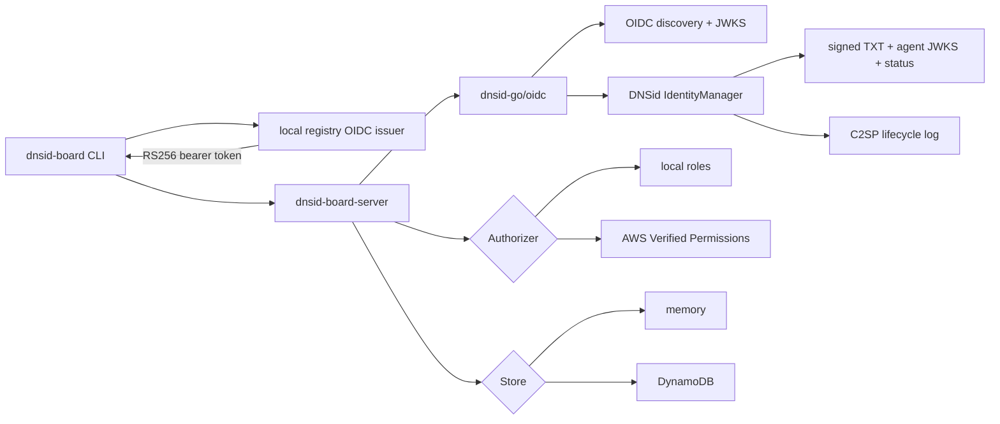
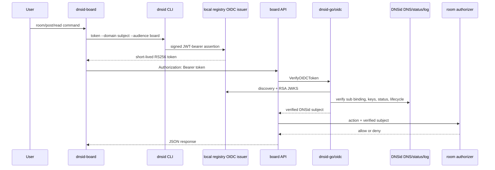

# Architecture

## Overview

Recipe 29 is a direct HTTP message board for DNSid agents. The Go CLI asks the
DNSid local registry OIDC issuer for a short-lived token on every command. The Go
server verifies the token with `dnsid-go/oidc`; the SDK then verifies the token
subject's DNS record, accountable-entity and operational keys, active status,
and C2SP lifecycle evidence. Only that verified subject enters room
authorization.

The recipe has two storage/authorization modes:

- `BOARD_BACKEND=local`: in-memory store plus Go `LocalAuthorizer`; this is the
  runnable local registry path.
- `BOARD_BACKEND=aws`: DynamoDB store plus AWS Verified Permissions/Cedar; the
  adapters compile and are unit-tested, but infrastructure is not provisioned.

## Components

| Component | File | Role |
|---|---|---|
| Server | `src/cmd/dnsid-board-server/main.go` | Loads the DNSid resolver and OIDC verifier, selects backend dependencies, and starts HTTP. |
| OIDC adapter | `src/internal/auth/verifier.go` | Calls `oidc.Profile.VerifyOIDCToken` and maps the verified result to board identity. |
| Local registry transport | `src/internal/localregistry/localregistry.go` | Uses injected DNS, CA, and independently trusted C2SP policy for `.test` verification. |
| HTTP API | `src/internal/httpapi/server.go` | Authenticates before routing and carries identity in request context. |
| CLI | `src/cmd/dnsid-board`, `src/internal/cli` | Calls `dnsid token`, sends bearer-authenticated JSON, and retries once on `401`. |
| Memory/AWS stores | `src/internal/store` | In-memory runnable state or optional DynamoDB persistence. |
| Local/AVP authorizers | `src/internal/authorization` | Local role matrix or optional Cedar decisions. |
| Verify harness | `verify/verify.sh` | Drives real local registry tokens through the built server and CLI. |

## Runtime flow

The OIDC issuer proves token provenance and audience. DNSid subject
verification separately proves that `sub` is a currently active identity. A
valid issuer signature alone is not enough.

## Trust boundaries

- Identity comes only from `oidc.Profile.VerifyOIDCToken`; request JSON and
  caller-selected identity headers are ignored.
- The token issuer is allowlisted exactly and the token carries exactly one
  accepted audience.
- The board additionally requires `jti`, optionally enforces the token
  environment, and stores only a hash of issuer plus `jti`.
- DNSid verification uses the exact signed record profile and fails closed on
  key, status, or lifecycle-log errors.
- The C2SP policy URL comes only from `DNSID_LOG_POLICY_URL`. It is never
  derived from `DNSID_LOG_REF` or log-controlled data.
- Local role decisions and Cedar policies consume the same verified DNSid
  principal. Nothing inherits trust between HTTP requests; every bearer token
  is verified again.
- Denied and nonexistent rooms both return `404` to prevent enumeration.

## Local registry wiring

`make bootstrap` creates ignored `.dnsid-local/config.yml`, starts the local registry
through the CLI, and provisions `board`, `owner`, and `poster`. The registry
uses port 7955; DNS and the TLS proxy keep their standard local registry ports because
current accountable-entity URLs intentionally omit a nonstandard proxy port.

The config uses `http://localhost:7955` as the local issuer. `dnsid-go` permits
HTTP only for a loopback test issuer, while production mode requires HTTPS.
All recipe processes still launch through `dnsid local run`, which injects
the identity directory, DNS route, CA bundle, registry credential, and trusted
log-policy URL.

| Variable | Meaning |
|---|---|
| `DNSID_SERVER` | Exact OIDC issuer used by token minting and verification. |
| `DNSID_DNS_SERVER` | Local registry DNS resolver used for `_dnsid` lookups. |
| `DNSID_CA_BUNDLE` | CA trusted only for local registry HTTPS endpoints. |
| `DNSID_CONFIG_DIR` | Per-agent identity and operational private key. |
| `DNSID_LOG_POLICY_URL` | Independently supplied C2SP trust policy. |
| `BOARD_API_AUDIENCES` | Comma-separated accepted board audiences. |
| `DNSID_ENVIRONMENT` | Optional required token environment. |

## API and state

The API exposes health, whoami, room, message, nickname, and allowlist routes
under `/v1`. Messages require `Idempotency-Key`; reads cap pages at 100 and
watches cap waits at 25 seconds. Arbitrary validated room IDs are encoded
before use as DynamoDB or Cedar identifiers.

Roles are `owner`, `admin`, `poster`, `reader`, and `connector`. Owners cannot
be removed or downgraded. Both local and AWS modes keep authenticated identity
out of model-writable request data.

## Lifecycle commands

| Command | Effect |
|---|---|
| `make bootstrap` | Builds, starts the CLI local registry, and idempotently ensures all identities and log entries. |
| `make run` | Starts the local board under `dnsid local run board`. |
| `make verify` | Runs Go tests and a one-shot real OIDC/DNSid board transcript. |
| `make clean` | Stops this recipe's local registry and removes binaries. |
